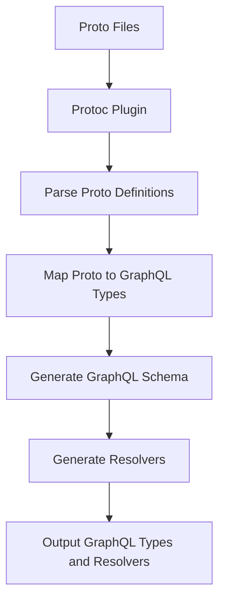
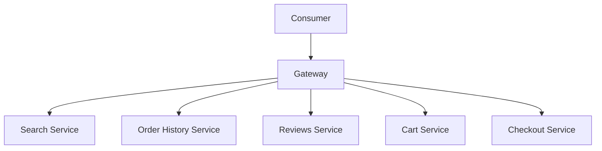
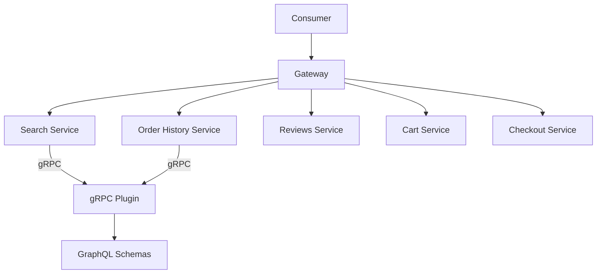
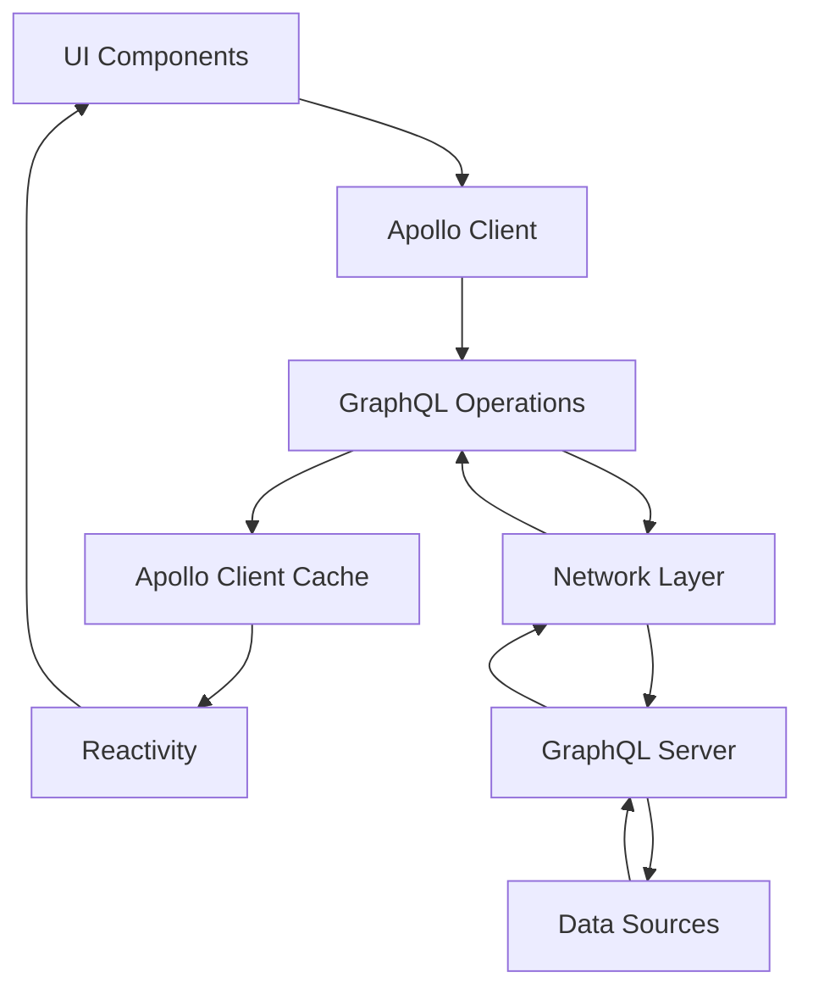
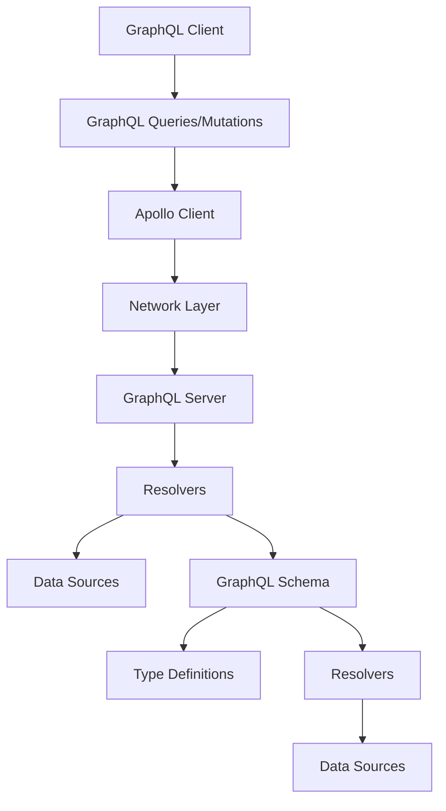
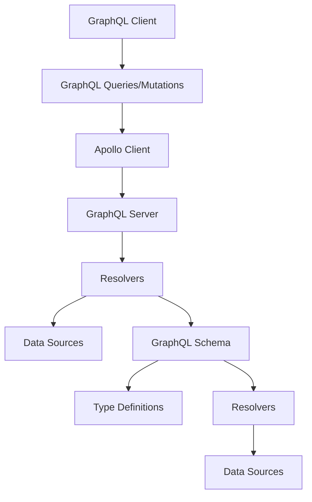
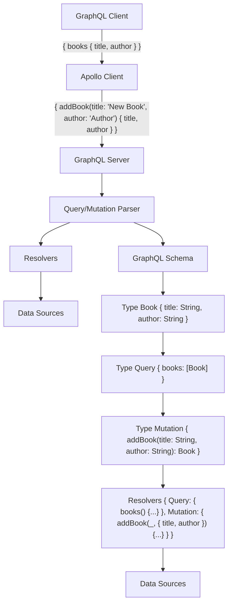

# graphql-over-grpc

Use grpc as a data source for graphql apollo server

## Start

1. [Install protoc](https://github.com/protocolbuffers/protobuf/releases) into `./vendor` folder, check `package.json` "compile:proto" script has correct path "vendor/protoc-23.2-osx-x86_64/bin/protoc",
2. Run

```bash
npm run compile:graphql
npm run start:grpc:server
npm run start:graphql:server
```

3. Go to [localhost:4000](http://localhost:4000/) and run query

```graphql
query ExampleQuery {
  grpcBooks {
    title
    author
  }
}
```

## Build & Run Locally

```bash
# use default protoc version
docker build -t local-protoc .
# or specify custom one
docker build --build-arg PROTOC_VERSION=24.0 -t local-protoc .
```

## GRPC Graphql Plugin

- `Protobuf Definitions`: The plugin should be able to parse the protobuf definitions (.proto files) which define the gRPC service and the message types it uses. This includes service methods and their request/response types.

- `GraphQL Schema Generation`: The plugin should be able to generate a GraphQL schema from the protobuf definitions. This involves mapping protobuf message types to GraphQL types and service methods to GraphQL queries or mutations. For example, in the graphql-over-grpc repository, the plugin generates a GraphQL schema where each gRPC service method becomes a GraphQL field.

- `GraphQL to gRPC Mapping`: The plugin should provide a way to map GraphQL requests to gRPC requests and vice versa. This involves converting GraphQL queries/mutations to gRPC method calls and converting the responses back to GraphQL. In the grpc-graphql-gateway repository, this is done using a GraphQL execution engine which resolves GraphQL fields to gRPC method calls.





This diagram:

- Consumer: This is the user or system that is making requests. It communicates with the Gateway.
- Gateway: This is the entry point for the Consumer. It routes requests from the Consumer to the appropriate services.
- Search Service: This service handles search-related requests.
- Order History Service: This service handles requests related to the user's order history.
- Reviews Service: This service handles requests related to reviews.
- Cart Service: This service handles requests related to the user's shopping cart.
- Checkout Service: This service handles checkout-related requests.



### About GraphQL Apollo

Apollo is a comprehensive state management library for JavaScript that enables you to manage both local and remote data with GraphQL. Here's a high-level overview of how it works:

1. **Apollo Client**: This is the core part of Apollo and acts as a comprehensive state management library that integrates with your JavaScript app. It enables you to fetch, cache, and modify application data, all while automatically updating your UI.

2. **Fetching Data**: Apollo Client uses a GraphQL server to fetch data. You write queries using the GraphQL query language and Apollo Client takes care of sending the query to your server and parsing the response.

3. **Caching**: Apollo Client caches the results of your queries, which can help to reduce the load on your server and improve performance. When a component is mounted, Apollo Client checks if the data for any queries it's making is already in the cache. If it is, Apollo Client uses the cached data instead of sending a new network request.

4. **Updating the UI**: Apollo Client integrates with your UI library (like React, Vue, Angular, etc.) and automatically updates your UI when the data changes. This is done through a system of "watched queries". When the results of a query change (either due to a network request or a cache update), any UI components that depend on that data are automatically re-rendered with the new data.

5. **Local State Management**: Apollo Client also allows you to manage local state alongside remote data. You can define local resolvers to handle local queries and mutations, and you can even mix local and server data in the same query.

6. **Apollo Server**: While not necessary to use Apollo Client, Apollo Server is a community-driven, open-source GraphQL server that works with any GraphQL schema. It's the perfect companion to Apollo Client, providing features like performance tracing, error tracking, and schema stitching.

In summary, Apollo provides a holistic solution to manage both local and remote data in JavaScript applications, making it easier to build complex, data-driven applications.

TODO: fix diagram



This diagram can be interpreted as follows:

1. **UI Components**: These are the visual elements of your application. They interact with Apollo Client to fetch and display data.

2. **Apollo Client**: This is the core part of Apollo. It manages both local and remote data and integrates with your UI components.

3. **GraphQL Operations**: These are the queries, mutations, and subscriptions that your UI components use to interact with your data.

4. **Apollo Client Cache**: Apollo Client caches the results of your queries to improve performance and enable offline functionality.

5. **Reactivity**: Apollo Client automatically updates your UI components when the data they depend on changes.

6. **Network Layer**: This is the part of Apollo Client that communicates with your GraphQL server.

7. **GraphQL Server**: This is your server that provides a GraphQL API. It fetches data from your data sources in response to queries from Apollo Client.

8. **Data Sources**: These are the databases, APIs, and other sources of data that your server uses to fetch data.

### How do you write your application?

- Schema First Design

- Schema Usage





TODO:fix diagram with arrow text instead of full edges



```mermaid

```

```mermaid

```

## Links

- [Join the XTechnology discord community](https://discord.com/invite/ZTnWdVpUPV) to collaborate and feedback on the project
- [Apollo Server - Fetching data](https://www.apollographql.com/docs/apollo-server/data/fetching-data)
- [grpc node.js simple start](https://github.com/x-technology/mono-repo-nodejs-svc-sample/tree/main/docs/demo-protobuf)
- [protoc plugins](https://github.com/protocolbuffers/protobuf/blob/main/docs/third_party.md)

- [rejoiner - Generates a GraphQL schema from gRPC microservices](https://github.com/google/rejoiner)

- [On GraphQL Gateway to serve Go GRPC microservices 2018 by Iheanyi Ekechukwu(@kwuchu), ](https://iheanyi.com/journal/2018/05/12/the-g-unit-stack-go-graphql-and-grpc/)

- https://www.apollographql.com/docs/apollo-server/
- https://www.apollographql.com/tutorials/lift-off-part1/05-apollo-server
- https://protobuf.dev/reference/other/

- https://github.com/xanthous-tech/grpc-graphql-schema
- https://x-tech.io/our-engineering-blog/translating-grpc-services-into-graphql
- https://medium.com/xanthous/translating-grpc-services-into-graphql-6a8e49556d96
- https://docs.google.com/presentation/d/11sw3yK7p6xYcES9Wsjco7z3lGgmYlefnNrqhZ6vaYvA/edit#slide=id.g4c78b68687_0_93

### [GraphQL](./graphql.md)

### Gateways

- [GraphQL Mesh A fully-featured GraphQL gateway framework, incl GRPC](https://the-guild.dev/graphql/mesh/docs/handlers/grpc)

## Backlog

- [ ] add tests for working server with dynamic generated schema using node test runner
  - [ ] make it in [docker](./protoc-gen-graphql/tests/Dockerfile)
- [ ] write a general purpose graphql server to work with generated grpc code
- [ ] create nestjs tutorial - schema first (nexus!) or code first?
- [ ] [check golang grpc gateway](https://github.com/grpc-ecosystem/grpc-gateway)
- [ ] protoc plugin to generate graphql schemas from grpc microservices
  > POC
  - [ ] traverse, find all messages and services from input files and generate graphl services
    - https://protobufjs.github.io/protobuf.js/Root.html#nested
    - https://github.com/protobufjs/protobuf.js/blob/master/examples/traverse-types.js
    - [alternative traverse](https://stackoverflow.com/questions/722668/traverse-all-the-nodes-of-a-json-object-tree-with-javascript)
    > use templates https://github.com/ysugimoto/grpc-graphql-gateway/blob/master/protoc-gen-graphql/template.go
    - generate graphql types [definitions](./graphql-server.ts#L15)
      [](https://graphql.org/graphql-js/constructing-types/)
    - generate resolvers
- [ ] document use cases
- [ ] npm publish prepare - restructure repo (mkdir example, mv server* example)

### Questions

- which grpc protobuf registry to choose? also, is it possible to use graphql apollo registry?
- is there a better transformation library?
- is it neccessary to to support all the protoc available flags?
- would it be easier to manually create graphql schemas?

## Meetings

### 2023-08-01

- [x] [Type System - GraphQL gRPC Comparison](./graphql.md)
- Backlog
  - Questions
- [Build Naive Implementation](https://graphql.org/graphql-js/constructing-types/)
  - Use [https://github.com/graphql/graphql-js](graphql-js), and specifically [types](https://graphql.org/graphql-js/type)
  - Tests

### 2023-06-24

- About Project
  - Start
- Backlog
  - Questions
- Links
